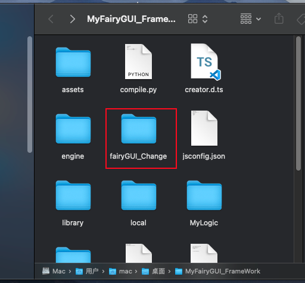
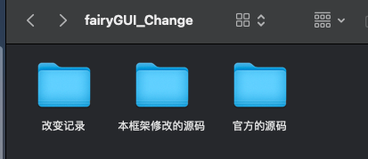
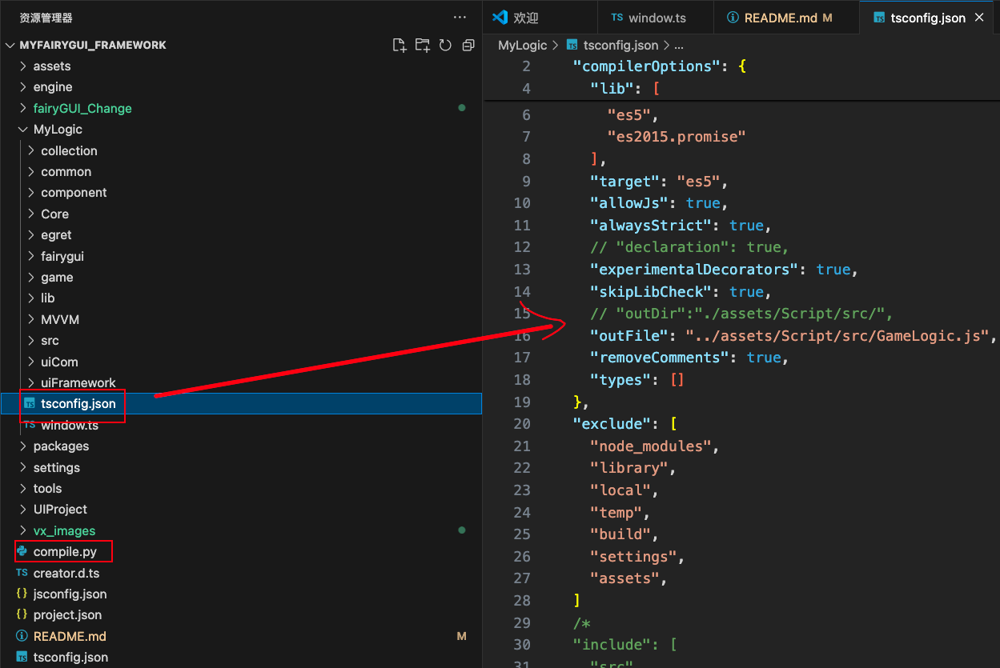
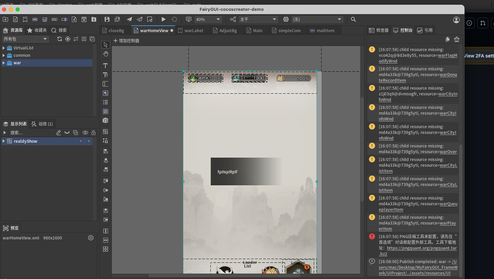
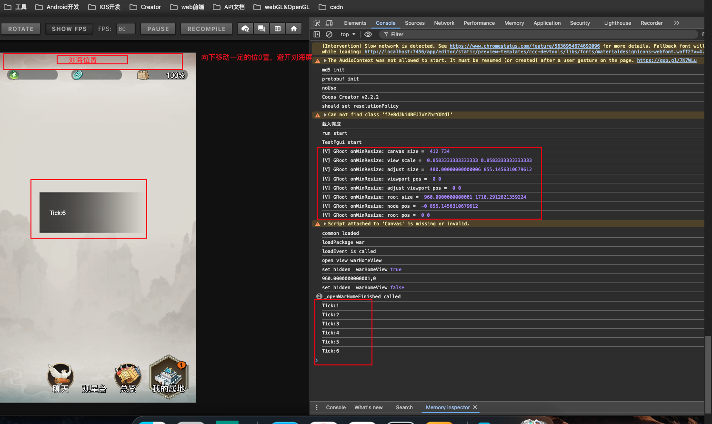

一个基于FairyGUi的UI框架,CocosCreator2.x中使用

https://github.com/fshunj88/MyFairyGUI_FrameWork

本人对底层源码进行了一些具体的分析，可以看这个BroadMix链接

[底层分析永久有效](https://boardmix.cn/app/share/CAE.CLfz5Q0gASoQ5kssisAjRSm9MbsF_0YFIzAGQAE/9AzkJn，)

支持特性：
I:一个单向绑定的良好的MVVM框架

II:竖屏的UI适配

III：比较多的实用工具，自己探索

IV：engine目录是JS-Engine目录，里面主要修改了cc.loader.removePipe,当然用引擎内置的engine也可以；

注意：对FairyGUi源码进行了一定的修改，看fairyGUI_Change文件夹；

为了方便调试：这里文件就是全部fairygui源码了

注意编译脚本，编译成一个GameLogic.js，compile.py在控制台执行即可

用FairyGUi编辑器打开UIProejct

浏览器运行效果：（一个定时器的例子，MVVM）
注意，可以看到那些宝玉，宝石等等那一栏和FairyGUi编辑器是位置是不同的，这是为了避开刘海屏的的位置进行的适配

本人对底层源码进行了一些具体的分析，可以看这个BroadMix链接

[底层分析永久有效](https://boardmix.cn/app/share/CAE.CLfz5Q0gASoQ5kssisAjRSm9MbsF_0YFIzAGQAE/9AzkJn，)

